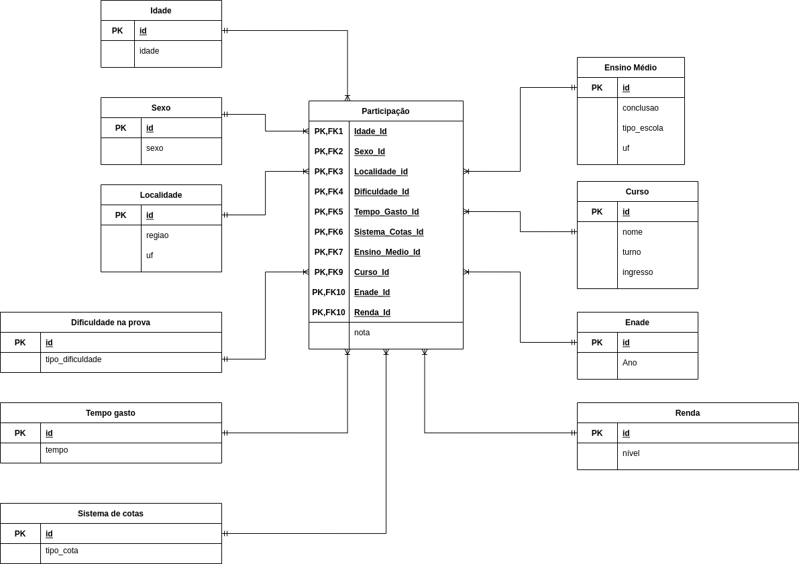

# Trabalho Final de Data Warehouse (Prova)
Aluno: Filipe José Maciel Ramalho  
Professor: Geraldo Xexéu

## Relatório do experimento:
Construção de um sistema de DW 

1. **(1,5 pontos) Realize a coleta de dados, obtendo os microdados do ENADE dos anos de
2019, 2018 e 2017, no site do INEP, facilmente encontrados na rede.
Deve ser feito um script/programa/fluxo KNIME ou em outra ferramenta que automatize a recuperação desses dados na rede. Esse programa deve ser apresentado no relatório.
O relatório final deve indicar onde esses dados podem ser coletados, que arquivos são obtidos, e
uma análise textual de que tipo de informação eles possuem.**

A coleta inicial dos dados é feita pelo script python [./download/get_data_from_web](./download/get_data_from_web.py);
Os dados coletados da base de dados do Enade são referenciados abaixo por ano:

* 2017:
https://download.inep.gov.br/microdados/Enade_Microdados/microdados_Enade_2017_portal_2018.10.09.zip
* 2018:  
https://download.inep.gov.br/microdados/Enade_Microdados/microdados_enade_2018.zip
* 2019:  
https://download.inep.gov.br/microdados/Enade_Microdados/microdados_enade_2019.zip

Todos os arquivos compactados coletados são salvos no diretório `data/zip_files`.
Após tais dados serem coletados em formato compactado, então é realizado, em cada um, o processo de extração. Ao final, os conteúdos extraídos são armazenados em 
`data/extracted_files/<ano>`, onde `<ano>` é diretório cujo nome é o ano referido aos itens acima.

Os arquivos coletados e extraídos, contém primariamente três diretórios:
* `1.LEIA-ME`: que são os metadados e informações sobre estes dados. Dentro deste diretório encontran-se dicionário de dados e referência para os códigos das UFs. Além de conter também manuais de utilização do dataset.
* `2.INPUTS`: que contém scripts básicos de leitura em algumas linguagens de programação.
* `3.DADOS`: que representam os dados do enade, neste diretório há um arquivo *.txt que contém os dados do enade em formato tabelado csv; 

2. **(2,5 pontos) Crie um modelo dimensional (estrela) a partir dos dicionários de dados encontrados
para os 3 anos. Esse modelo dimensional, para cada dimensão, deve abarcar os dados disponíveis nos 3 anos analisados, mesmo que haja diferença entre os anos na dimensão.
O número de dimensões não deve ultrapassar 15 e não ser menor que 10. Podem
ser criadas dimensões formadas pela combinação de colunas, se for interessante para ser usada nas
questões 5 e 6 dessa prova. Caso sejam identificadas mais de uma tabela fato, pode ser usado mais de um modelo.
Pode também ser necessário incluir outros dados que não estão nos arquivos de dados, por exemplo,
a substituição de códigos por significados, de acordo com o dicionário de dados, ou de acordo com
outra base disponibilizada. Se for necessário baixar outra base, isto deve estar descrito na seção
anterior. Devem ser indicadas as ferramentas usadas para análise e desenho do modelo de dados.**

Para a criação do modelo estrela foi utilizado a ferramenta `draw.io`. O modelo original está disponível no endereço 
[https://app.diagrams.net/?title=ProvaDW-diagrama-estrela.drawio#Uhttps%3A%2F%2Fdrive.google.com%2Fuc%3Fid%3D1ecJpig3E-9WqByIQMLBwVkZgzTVbCqS8%26export%3Ddownload](https://app.diagrams.net/?title=ProvaDW-diagrama-estrela.drawio#Uhttps%3A%2F%2Fdrive.google.com%2Fuc%3Fid%3D1ecJpig3E-9WqByIQMLBwVkZgzTVbCqS8%26export%3Ddownload)

Abaixo encontra-se a imagem do modelo gerado.

3. **(0,5 ponto) Crie a base de dados do Data Warehouse em um banco de dados relacional, relatando
o script SQL usado para isso.
Pode ser usado qualquer banco relacional, ou consultável via SQL. Quem usar Python ou outra
linguagem de programação pode usar um banco de dados simples, como o SQLite.**

Para o banco de dados há também um script em python que importa um script sql e constrói um banco sqlite. O arquivo do banco Sqlite é salvo em `data/enade_data.db`.
O arquivo de script sql está no caminho `database/database_schema.sql` e o arquivo python que o importa e executa está em `database/create_database.py`.

4. **(1,0 ponto) Nesta questão é feita a carga de dados. Todos os dados devem ser alimentados em um
banco de dados relacional, a sua escolha, local ou on-line, de acordo com o modelo dimensional
planejado.
Deve ser detalhadamente descrita a forma de carga de dados. Configurações de ferramentas de
carga ou programas feitos devem ser listados. Fluxos do KNIME devem ser descritos por seu
desenho e por seu XML.
Diferença entre as 3 bases que causem problemas nos dados, como dados faltantes, devem ser
indicadas.
Serão aceitas soluções que criem as tabelas em arquivos .CSV, mas apenas no caso de alunos com
máquinas muito fracas. Nesse caso, deve ser feita a descrição da máquina no relatório e isso será
julgado. A priori, nesse caso, é melhor usar o Google Colab com SQLite, por exemplo.**

A partir das informações descritas no dicionário de dados, para a carga de dados, foi utilizado o script em python que, 
processa os dados do enade presentes no arquivo csv já mencionado, 
transforma estes dados e transfere os dados transformados para o banco de dados SQlite criado.

5. **(2,0 pontos) Nesta questão deve ser feita a análise de dados.
Devem ser propostas 5 perguntas que demonstrem alguma característica interessante sobre o
resultado do ENADE e criadas, a partir de programas/scripts/fluxos KNIME ou outra ferramenta,
pelo menos 1 tabela e 1 gráfico que esclareça o questionamento feito.
Respostas típicas incluem box-plots, scatter-plots com linhas de regressão, etc. As perguntas esperadas podem questionar se há alguma diferença de resultado o ENADE (fato) em função de uma
ou mais dimensões criadas. Dimensões como características demográficas.
Devem ser apresentados no relatório todos os programas utilizados e a saída proposta.**

6. **(2,0 pontos) Nessa questão deve ser feita uma tentativa de aprender algo a partir dos dados.
Para isso pode ser usado qualquer programa/biblioteca/módulo de aprendizado.
Deve ser feita uma proposta de aprendizado, por exemplo: “descobrir a nota do ENADE em função
das variáveis X,Y,Z com o algoritmo W”. Essa proposta deve ser implementada e seus resultados
apresentados. Não é necessário que seja aprendido algo relacionado ao fato, pode ser aprendido,
por exemplo, que tipo de aluno acha a prova fácil.
É obrigatório que haja algum aprendizado, para isso será considerado uma Acurácia maior que
60% e Precisão maior que 60%. Devem ser feitas pelo menos 2 tentativas de aprender a mesma
coisa. Caso em 2 tentativas não se alcance a acurácia desejada, isso deve ser relatado. As tentativas
devem incluir mudanças significativas nos dados ou nos algoritmos.**

7. **(0,5 ponto) Liste todas as ferramentas utilizadas, indicando o motivo da escolha. Inclua um link
de referência para cada ferramenta.**

   1. Python
   2. Sqlite
   3. Jetbrains Pycharm
   4. Github
   5. Markdown